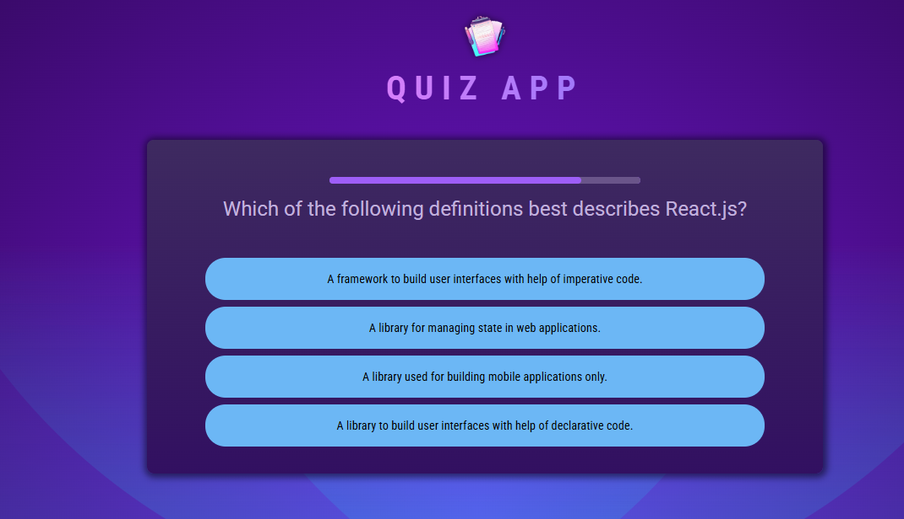
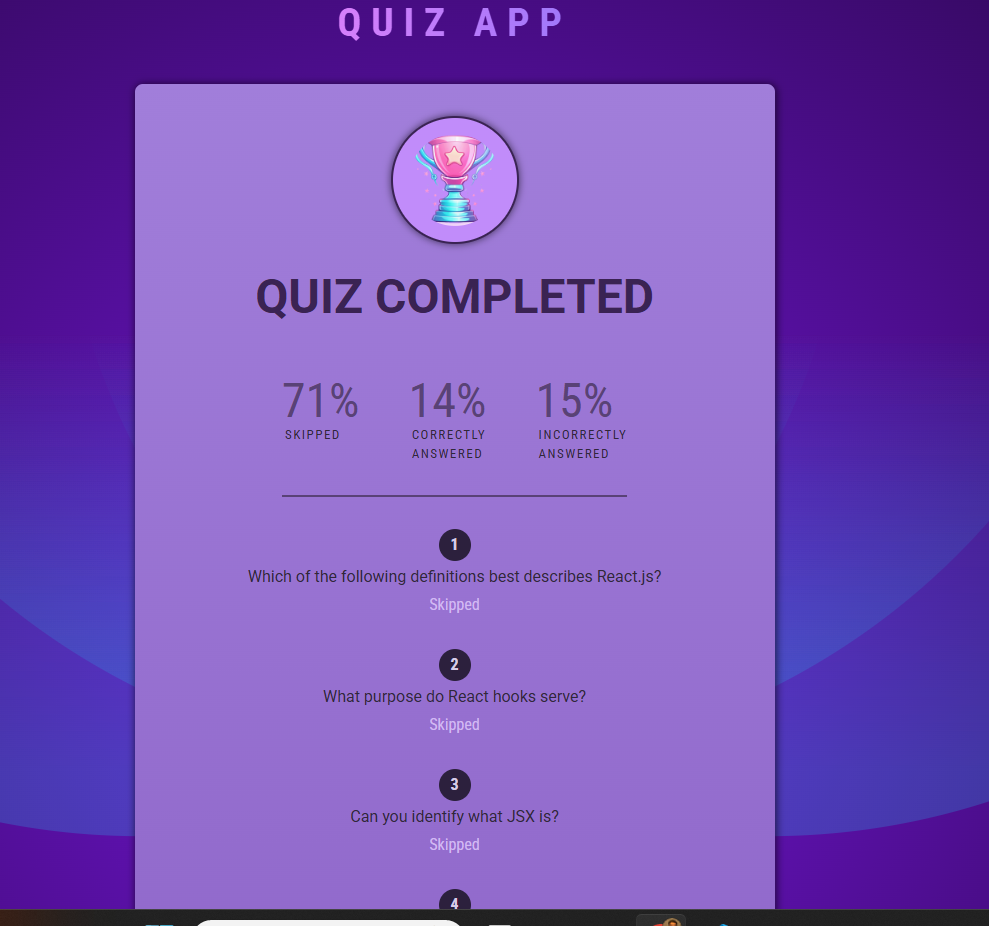

# React Quiz App

This is a simple React-based quiz application that presents a series of questions and tracks user responses. The app includes features like answer selection, automatic answer validation, and a quiz timer.

## Features
- Dynamic question rendering
- Answer selection with validation
- Timer-based question progression
- Skip question functionality
- Quiz summary at the end

## Technologies Used
- React.js
- React Hooks (useState, useCallback)
- JavaScript (ES6+)

## Installation

1. Clone the repository:
   ```sh
   git clone https://github.com/your-username/react-quiz-app.git
   ```
2. Navigate to the project directory:
   ```sh
   cd react-quiz-app
   ```
3. Install dependencies:
   ```sh
   npm install
   ```
   ## Live link
   You can check live demo (https://splendorous-pothos-ea1fdd.netlify.app/)


## Usage

To run the application locally, execute:
```sh
npm start
```
The app will be available at `http://localhost:3000/`.

## Project Structure
```
react-quiz-app/
│── src/
│   ├── components/
│   │   ├── Header.jsx
│   │   ├── Quiz.jsx
│   │   ├── Questions.jsx
│   │   ├── QuizTimer.jsx
│   │   ├── Answers.jsx
│   ├── utils/
│   │   ├── questions.js
│   ├── App.jsx
│   ├── index.js
│── public/
│── package.json
│── README.md
```


## License
This project is licensed under the MIT License.


